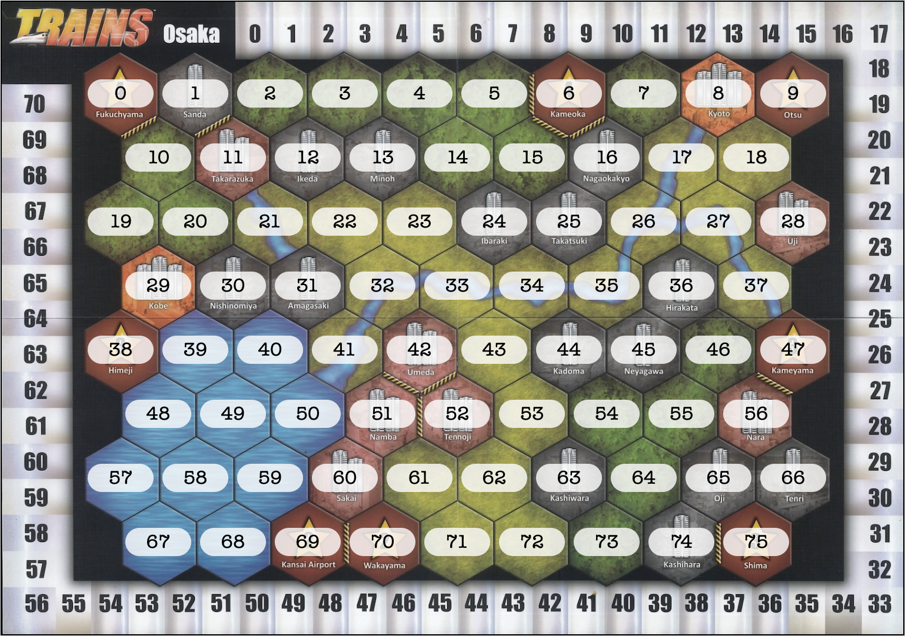

# Entrées / sorties

Les instructions de l'utilisateur sont transmises au programme sous la forme de chaînes de caractères. Le programme exécute les instructions de la partie et s'arrête à chaque fois qu'il attend une instruction de l'utilisateur (choix à faire par un joueur).

Le joueur peut entrer ses instructions de différentes manières :

- dans le terminal, en tapant les instructions au clavier ;
- dans l'interface graphique en entrant les instructions dans l'élément `input` prévu à cet effet (identique à une entrée dans le terminal)
- en cliquant sur les éléments de l'interface graphique :
  - cliquer sur une carte dans la main du joueur ou dans la zone "en jeu" envoie le nom de la carte ;
  - cliquer sur une pile de cartes dans la réserve envoie `"ACHAT:"` suivi du nom de la carte ;
  - cliquer sur une case du plateau envoie `"TUILE:"` suivi de l'indice de la case (cf. [Construire un rail](#construire-un-rail)) ;
  - cliquer sur le bouton _Passer_ envoie la chaîne de caractères vide `""`.
  - cliquer sur un bouton proposé par le programme envoie la chaîne de caractères associée au bouton.

**Indication :** Lorsque vous utilisez l'interface graphique dans le navigateur, vous pouvez ouvrir la console du navigateur qui affichera tous les messages envoyés au programme lorsque vous cliquez sur les différents éléments.

## Utilisation de la méthode `Joueur.choisir`

Pour demander à l'utilisateur de faire un choix dans le jeu, il est recommandé d'utiliser la méthode `choisir` de la classe `Joueur`. Cette méthode prend 4 arguments :

- `String instruction` : affiche un message à l'utilisateur pour indiquer la nature du choix ;
- `Collection<String> choix` : un ensemble de `String` qui indiquent les choix autorisés ;
- `List<Bouton> boutons` : une liste de boutons à afficher dans l'interface graphique pour proposer des choix supplémentaires qui ne peuvent pas être faits en cliquant sur des éléments de l'interface graphique ;
- `boolean peutPasser` : un booléen qui indique si le joueur a le droit de passer (entrer `""`).

Bien qu'un peu complexe à appréhender au début, cette méthode permet de gérer de manière uniforme toutes les interactions avec l'utilisateur.

### Exemple d'utilisation

Supposons que l'on veuille faire choisir au joueur une carte parmi les cartes qu'il a en main. On peut utiliser la méthode `choisir` en lui fournissant la liste des noms des cartes de la manière suivante :

```java
List<String> nomsCartes = new ArrayList<>();
for (Carte carte : main) {
    nomsCartes.add(carte.getNom());
}
String nomCarteChoisie = choisir("Choisissez une carte en main", nomsCartes, null, false);
```

Ici, on ne propose pas de boutons donc le troisième argument est `null`. Par ailleurs, on veut forcer le joueur à choisir une carte, sans qu'il puisse passer sans choisir. Ainsi, le dernier argument est `false`.

Lorsque la méthode `choisir` est exécutée, le programme va lire les entrées de l'utilisateur (soit depuis le terminal, soit depuis l'interface graphique) jusqu'à ce qu'il reçoive une entrée valide (c'est-à-dire une entrée qui est égale à un des choix proposés). Tant que le choix de l'utilisateur n'est pas valide, la méthode continue d'attendre une entrée du joueur.

La valeur renvoyée par la fonction est donc le premier choix valide de l'utilisateur (et il est garanti que cette valeur est bien dans la liste des choix proposés).

Si l'on voulait maintenant proposer au joueur de choisir soit le nom d'une carte en main, soit une valeur parmi `"plus"` ou `"moins"`, soit de passer, on pourrait écrire :

```java
List<String> nomsCartes = new ArrayList<>();
for (Carte carte : main) {
    nomsCartes.add(carte.getNom());
}
List<Bouton> boutons = new ArrayList<>();
boutons.add(new Bouton("Augmenter", "plus"));
boutons.add(new Bouton("Réduire", "moins"));
String nomCarteChoisie = choisir("Choisissez une carte en main", nomsCartes, boutons, true);
```

Ici, en plus des choix de noms de cartes en main, on passe comme 3ᵉ argument une liste de deux boutons. Le premier bouton a pour étiquette "_Augmenter_" et s'il est cliqué, il envoie "_plus_". Le second a l'étiquette "_Réduire_" et il envoie "_moins_" lorsqu'il est cliqué. Enfin le dernier argument est `true` ce qui signifie que le joueur est autorisé à envoyer `""` pour passer.

Ainsi, si le joueur clique sur une carte _Gare_ qu'il a en main, la fonction `choisir` renverra `"Gare"`. Si par contre, il clique sur le bouton _Augmenter_ la fonction renverra `"plus"` et si le joueur clique sur le bouton _Passer_ la fonction renverra `""`. Pour tout autre choix non valide (ni un nom de carte en main, ni un des boutons proposés, ni `""`) la fonction continue d'attendre une entrée de l'utilisateur.

**Remarque :** Afin d'éviter les blocages, si la liste des choix proposés est vide (aucun élément ni dans `choix`, ni dans `boutons`) alors la fonction `choisir` accepte le choix `""` indépendamment de la valeur de `peutPasser`. Cela signifie que lorsqu'on demande à l'utilisateur de choisir parmi une liste sans l'autoriser à passer, il est tout de même possible que le choix final soit `""` si la liste des choix proposés était vide.

## Début de partie

Lorsque la partie est lancée, les joueurs doivent placer leur premier jeton *Rail* sur une case du plateau (avec certaines contraintes, cf. [les règles du jeu](https://gitlabinfo.iutmontp.univ-montp2.fr/dev-objets/ressources/-/blob/master/regles.pdf)). Au début de la méthode `Jeu.run`, il faut donc commencer par demander à chaque joueur de choisir son emplacement de départ en attendant qu'il envoie une chaîne de caractères de la forme `"TUILE:"` suivi de l'indice de la case sur laquelle il souhaite placer son jeton _Rail_ initial (cf. [Construire un rail](#construire-un-rail) pour les indices des tuiles).

Une fois que chacun des joueurs a placé son jeton _Rail_ initial, la boucle principale de la méthode `Jeu.run` s'exécute, qui va appeler successivement les méthodes `jouerTour` de chaque joueur.

## Jouer une carte de la main

Pendant son tour, le joueur peut jouer certaines cartes de sa main. Pour cela, il envoie le nom de la carte (ce qui correspond à cliquer sur la carte dans l'interface graphique).

Lorsqu'il choisit de jouer une carte, le programme retire la carte de la main du joueur, l'ajoute à la pile de cartes _en jeu_ du joueur et exécute l'effet de la carte.

Les cartes _VICTOIRE_ (_Appartement_, _Immeuble_ et _Gratte-ciel_) ne peuvent pas être jouées depuis la main.

Les cartes _FERRAILLE_ ne peuvent être jouées que si c'est la première action du tour du joueur pour [recycler la ferraille](#recycler-la-ferraille).

## Précisions concernant certaines cartes

### Atelier de maintenance

> Dévoilez une carte _TRAIN_ de votre main. Recevez une carte identique à celle dévoilée (s'il en reste dans la réserve).

Le joueur doit choisir une carte _TRAIN_ qu'il a en main et le programme donne automatiquement la carte de la réserve. Si le joueur a une carte _TRAIN_ en main, alors il ne peut pas passer.

**Input attendu :** Le nom d'une carte _TRAIN_ que le joueur a en main.

### Bureau du chef de gare

> Choisissez une carte ACTION que vous avez en main. Cette carte copie l'effet de la carte choisie.

Le joueur peut choisir une carte _ACTION_ qu'il a en main. Le programme exécute automatiquement l'action de la carte choisie.

La carte _Bureau du chef de gare_ est placée dans les cartes en jeu normalement, mais la carte choisie et dont l'action est exécutée n'est pas retirée de la main du joueur.

Pour éviter un blocage, si le joueur a deux _Bureau du chef de gare_ en main et aucune autre carte _ACTION_, le joueur est autorisé à passer après avoir joué la carte. Dans ce cas aucune action n'est exécutée.

**Input attendu :** Le nom d'une carte _ACTION_ que le joueur a en main, ou `""` pour passer.

### Cabine du conducteur

> Défaussez autant de cartes que vous voulez de votre main. Piochez 1 carte par carte défaussée.

Le joueur choisit successivement des cartes qu'il a en main. Chaque carte choisie est défaussée immédiatement. À tout moment le joueur peut choisir de passer, et à ce moment le programme pioche autant de cartes dans la main du joueur que le nombre de cartes qui ont été défaussées.

**Input attendu :** une séquence de noms de cartes que le joueur a en main, puis `""` pour passer.

### Centre de contrôle

> Piochez 1 carte puis nommez une carte. Dévoilez la première carte de votre deck. Si c'est la carte nommée, ajoutez-la à votre main. Sinon, remettez-la sur votre deck.

Le programme pioche automatiquement la première carte et la place dans la main du joueur. Ensuite le joueur doit choisir le nom d'une carte parmi toutes les cartes qui existent dans la partie. Une fois le nom de la carte choisi, le programme pioche la première carte, et la place automatiquement soit dans la main du joueur, soit à nouveau sur le dessus de la pioche selon le résultat.

Étant donné que le joueur peut choisir le nom d'une carte qu'il n'a pas en main (ou en jeu), il faudrait proposer les choix sous la forme de boutons (un bouton par carte qui existe dans la partie).

Par ailleurs, pour des raisons de lisibilité, il est préférable de faire en sorte que le nom de la carte qui a été retournée soit affiché dans le log du jeu, mais ce n'est pas indispensable (pas testé).

**Input attendu :** Le nom d'une carte parmi toutes les cartes qui existent dans la partie.

### Centre de renseignements

> Dévoilez les 4 premières cartes de votre deck. Vous pouvez en prendre 1 dans votre main. Remettez les autres sur le dessus de votre deck dans l'ordre de votre choix.

Le programme retourne automatiquement les 4 premières cartes de la pioche. Le joueur doit alors d'abord choisir le nom d'une des cartes retournées (pour la prendre en main) ou passer (pour ne rien prendre). Ensuite le joueur doit choisir parmi les noms des cartes restantes, chaque carte choisie est replacée sur le dessus de la pioche (donc la dernière carte choisie sera sur le dessus de la pioche).

Les choix des noms de cartes devraient se faire à l'aide de boutons pour pouvoir indiquer les cartes qui ont été retournées.

**Attention :** S'il reste strictement moins de 4 cartes disponibles à retourner (dans la pioche et la défausse) le programme ne retourne que les cartes disponibles et le joueur choisit parmi celles-ci.

**Input attendu :** En premier le nom d'une des cartes retournées ou `""`. Ensuite, tant qu'il reste des cartes à replacer sur la pioche, on attend le nom d'une des cartes pour la remettre sur la pioche.

### _Coopération_, _Pont en acier_, _Pose de rails_, _Tunnel_, _Viaduc_ et _Voie souterraine_

Lorsque le joueur joue une de ces cartes, son attribut `pointsRails` est incrémenté de 1 (ce compteur est remis à 0 à la fin du tour). Cela permet ensuite au joueur de poser des rails sur le plateau (cf. [Construire un rail](#construire-un-rail)).

Les effets sont appliqués automatiquement pendant le tour, sans intervention de la part du joueur. Les effets n'annulent que le surcoût spécifique à la carte jouée :

- _Coopération_ : le surcoût lié à la présence d'autres joueurs est annulé, mais s'il construit un rail sur une montagne où se trouvent d'autres joueurs, il doit quand même payer le surcoût de 2¥ lié à la montagne. De même, le joueur ne reçoit pas la carte _FERRAILLE_ liée à la construction d'un rail là où se trouvent d'autres joueurs, mais il reçoit normalement les _FERRAILLE_ provenant d'autres effets pendant son tour.

- _Pont en acier_, _Tunnel_, _Viaduc_ : le surcoût provenant du type de la case est annulé, mais le surcoût éventuel lié à la présence d'autres joueurs (et la carte _FERRAILLE_ associée) est toujours compté.

- _Voie souterraine_ : tous les surcoûts d'argent pour poser des rails sont annulés (terrain, ville ou autres joueurs), mais le joueur reçoit tout de même une carte _FERRAILLE_ s'il construit un rail sur une case où se trouvent d'autres joueurs.

### Décharge

> Remettez toutes vos cartes _FERRAILLE_ en main sur la pile _FERRAILLE_.

L'action est exécutée automatiquement sans aucun _input_ de la part du joueur.

### Dépôt

> Piochez 2 cartes. Défaussez 2 cartes de votre main.

Le programme pioche automatiquement deux cartes et les place dans la main du joueur. Le joueur doit ensuite choisir deux cartes qu'il a en main pour les défausser.

**Attention :** Si après avoir pioché, le joueur a strictement moins de 2 cartes en main, alors il doit défausser ce qu'il a, mais l'exécution de la carte se termine lorsqu'il n'a plus de cartes en main.

**Input attendu :** Deux noms de cartes que le joueur a en main (après avoir pioché)

### Dépotoir

> Vous ne recevez aucune carte _FERRAILLE_ durant ce tour.

L'effet est appliqué automatiquement pendant le tour, sans intervention de la part du joueur.

**Attention :** L'effet n'est pas rétroactif, si le joueur a déjà reçu une _FERRAILLE_ pendant son tour avant de joueur le _Dépotoir_, alors il la garde.

### Échangeur

> Remettez une carte _TRAIN_ de votre zone de jeu sur le dessus de votre deck.

Le joueur doit choisir une carte _TRAIN_ parmi ses cartes en jeu. La carte est retirée de la zone en jeu et remise sur le dessus de la pioche. Le joueur est autorisé à passer s'il ne souhaite pas replacer de carte sur son deck.

**Input attendu :** Le nom d'une carte _TRAIN_ que le joueur a en jeu, ou `""` pour passer.

**Remarque :** Dans l'interface graphique, cliquer sur une des cartes en jeu envoie le nom de la carte, donc il n'est pas nécessaire de proposer le choix par des boutons.

### Ferronnerie

> Durant ce tour, recevez 2¥ à chaque fois que vous
> jouez une carte _RAILS_.

L'effet est appliqué automatiquement pendant le tour, sans intervention de la part du joueur.

### Feu de signalisation

> Piochez 1 carte puis consultez la première carte de votre deck. Défaussez-la ou replacez-la sur le dessus de votre deck.

La première carte est piochée automatiquement et placée dans la main du joueur. La seconde carte est ensuite piochée automatiquement et le joueur doit entrer `"oui"` pour la défausser ou `"non"` pour la replacer sur le dessus de la pioche.

**Attention :** S'il n'y a aucune carte à piocher (pioche et défausse vides) pour la seconde carte, alors aucun choix n'est demandé au joueur.

**Input attendu :** `"oui"` pour défausser la carte ou `"non"` pour la replacer sur le dessus de la pioche.

### Gare

Lorsque le joueur joue une carte _Gare_, il doit sélectionner la case ou placer la gare en envoyant `"TUILE:"` suivi de l'indice de la case sur laquelle il souhaite construire la gare (cf. [Construire un rail](#construire-un-rail) pour l'indexation des tuiles). Le choix du joueur doit être une case valide pour construire une nouvelle gare (une ville avec encore au moins une place libre).

Le programme ajoute ensuite la gare sur la case choisie et le joueur reçoit une _FERRAILLE_ (s'il en reste en réserve).

**Remarque :** S'il ne reste plus de jetons _Gare_ disponibles le joueur ne choisit pas de tuile, mais il reçoit tout de même une _FERRAILLE_.

**Input attendu :** `"TUILE:"` suivi de l'indice d'une case sur laquelle le joueur peut construire une gare.

### Horaires estivaux

> Vous pouvez écarter cette carte. Dans ce cas,
> recevez 3¥ .

Le joueur doit choisir `"oui"` s'il souhaite écarter la carte et recevoir 3¥ ou `"non"` pour ne rien faire.

Dans l'interface graphique le choix devrait être proposé sous la forme de boutons.

**Input attendu :** `"oui"` pour écarter la carte ou `"non"` pour ne rien faire.

### Horaires temporaires

> Dévoilez des cartes de votre deck jusqu'à ce que vous dévoiliez 2 _TRAIN_ Ajoutez ces cartes _TRAIN_ à votre main et défaussez le reste.

L'action est exécutée automatiquement sans aucun _input_ de la part du joueur.

**Attention :** S'il y a strictement moins de 2 cartes _TRAIN_ dans la pioche (+ défausse), alors toutes les cartes _TRAIN_ disponibles sont ajoutées à la main du joueur et toutes les autres cartes sont défaussées.

### Parc d'attractions

> Recevez X¥ . X est égal à la valeur d'une de vos cartes _TRAIN_ en jeu.

Le joueur doit envoyer le nom d'une carte _TRAIN_ qu'il a en jeu (ou cliquer sur une carte _TRAIN_ en jeu dans l'interface graphique).

**Input attendu :** Le nom d'une carte _TRAIN_ que le joueur a en jeu.

### Personnel de gare

> Choisissez 1 parmi ces 3 options : Piochez 1 carte. Recevez 1¥ . Remettez 1 _FERRAILLE_ sur la pile _FERRAILLE_.

Le joueur doit choisir en envoyant `"piocher"` pour piocher une carte ou `"argent"` pour recevoir 1¥ ou `"ferraille"` pour remettre une _FERRAILLE_ de sa main sur la pile _FERRAILLE_.

Dans l'interface graphique le choix devrait être proposé sous la forme de boutons.

**Remarque :** Le joueur peut choisir une action même si celle-ci n'a aucun effet (par exemple `"piocher"` si aucune carte disponible ou `"ferraille"` si aucune _FERRAILLE_ en main).

**Input attendu :** `"piocher"`, `"argent"` ou `"ferraille"`.

### Remorquage

> Prenez une carte _TRAIN_ de votre défausse et ajoutez-la à votre main.

Le joueur doit choisir le nom d'une carte _TRAIN_ dans sa défausse. La carte est alors retirée de la défausse et ajoutée à la main du joueur.

Le joueur doit choisir le nom d'une carte, sauf s'il n'y a aucune carte _TRAIN_ dans la défausse (dans ce cas il doit entrer `""` pour passer).

Les noms des cartes _TRAIN_ dans la défausse devraient être proposés dans l'interface graphique sous la forme de boutons.

**Input attendu :** Le nom d'une carte _TRAIN_ que le joueur a en défausse, ou `""` pour passer (uniquement s'il n'y a aucune carte disponible).

### TGV

> Recevez 1¥ si vous avez un _Train omnibus_ en jeu.

L'effet est exécuté automatiquement. L'effet ne se produit que si le joueur a déjà une carte _Train omnibus_ en jeu au moment où le _TGV_ est joué.

L'effet n'est pas cumulé si le joueur a plusieurs _Train omnibus_ en jeu au moment où le _TGV_ est joué.

### Train de marchandises

> Remettez sur la pile _FERRAILLE_ autant de cartes _FERRAILLE_ que vous voulez de votre main. Recevez 1¥  par carte _FERRAILLE_ remise.

Le joueur doit entrer le nom des cartes _FERRAILLE_ qu'il souhaite remettre sur la pile _FERRAILLE_ (le nom est toujours `"Ferraille"`). À chaque fois qu'il entre le nom d'une carte la carte est remise sur la réserve et l'argent du joueur est incrémenté de 1¥.

Le joueur doit passer (`""`) pour terminer l'effet de la carte.

**Input attendu :** Une séquence de noms de cartes _FERRAILLE_ que le joueur a en main (donc une séquence de `"Ferraille"`), puis `""` pour passer.

### Train matinal

> Vous pouvez placer sur votre deck les cartes que vous achetez durant ce tour.

Pendant tout le reste du tour après avoir joué cette carte, à chaque fois que le joueur **achète** une carte, il doit envoyer soit `"oui"` pour que la carte achetée soit placée sur le dessus de sa pioche, soit `"non"` pour que la carte achetée soit placée dans ses cartes reçues.

Cet effet ne concerne pas les cartes reçues autrement que par achat (par exemple les cartes _FERRAILLE_).

Dans l'interface graphique, il faudrait proposer le choix à l'aide de boutons après chaque achat d'une carte.

**Input attendu :** Après chaque achat pendant le tour, `"oui"` pour placer la carte achetée sur le dessus de la pioche ou `"non"` pour la placer dans les cartes reçues.

### Train postal

> Défaussez autant de cartes que vous voulez de votre main. Recevez 1¥  par carte défaussée.

Le joueur peut entrer des noms de cartes qu'il a en main. Pour chaque nom de carte entré, la carte est défaussée et l'argent du joueur est incrémenté de 1. À tout moment le joueur peut entrer `""` pour passer et terminer l'effet de la carte.

**Input attendu :** Une séquence de noms de cartes que le joueur a en main, puis `""` pour passer.

### Usine de wagons

> Écartez une carte _TRAIN_ de votre main. Recevez une carte _TRAIN_ coutant jusqu'à 3¥  de plus que la carte écartée. Ajoutez cette nouvelle carte à votre main.

Le joueur doit entrer le nom d'une carte _TRAIN_ qu'il a en main, puis envoyer `"ACHAT:"` suivi du nom de la carte _TRAIN_ qu'il souhaite recevoir. Le programme retire la carte choisie en premier de la main du joueur et l'écarte (ajoutée à la liste `jeu.cartesEcartees`), puis prend la carte choisie en second sur le dessus de la réserve et l'ajoute à la main du joueur.

Le fait d'entrer `"ACHAT:"` suivi du nom de la carte à recevoir, permet de faire le choix en cliquant sur les piles de réserve dans l'interface graphique.

**Input attendu :** Le nom d'une carte _TRAIN_ que le joueur a en main, puis `"ACHAT:"` suivi du nom d'une carte _TRAIN_ disponible en réserve dont le coût d'achat est inférieur ou égal au coût d'achat de la première carte choisie + 3.

## Autres actions

### Passer

Lorsque le joueur souhaite terminer son tour il peut passer en envoyant la chaîne de caractères vide `""` (ou cliquer sur le bouton _Passer_ de l'interface graphique qui envoie `""`).

### Recycler la _Ferraille_

Pour recycler les cartes _FERRAILLE_ qu'il a en main, le joueur peut envoyer `"Ferraille"` (ou cliquer sur une carte _FERRAILLE_ en main) au début de son tour, **avant toute autre action**. Dans ce cas le programme remet toutes les cartes _FERRAILLE_ que le joueur a en main sur le dessus de la réserve et le tour du joueur est immédiatement terminé.

### Acheter une carte

Au cours de son tour, le joueur peut choisir d'acheter une carte de la réserve (sauf les _FERRAILLE_). Pour cela, il envoie `"ACHAT:"` suivi du nom de la carte qu'il souhaite acheter (par exemple `"ACHAT:Train omnibus"`).

Si le joueur a assez d'argent pour acheter la carte et qu'il reste des cartes dans la réserve, la première carte de la réserve demandée est placée dans la pile de cartes reçues du joueur et le coût de la carte est déduit de l'argent du joueur.

**Remarque :** Cliquer sur une pile de réserve dans l'interface graphique envoie la chaîne de caractères `"ACHAT:"` suivie du nom de la pile cliquée.

### Construire un rail

Au cours de son tour, le joueur peut construire un rail sur une case du plateau. Pour cela, il envoie `"TUILE:"` suivi de l'indice de la case sur laquelle il souhaite construire le rail. Les tuiles sont indexées de 0 à 75 dans l'ordre de lecture ci-dessous :



Si le joueur a au moins un point de construction de rails (attribut `pointsRails`, incrémenté en jouant des cartes _RAILS_) et qu'il a le droit de construire un rail sur la case choisie, le rail est construit et les effets sont appliqués (décrémentation de `pointsRails`, paiement du surcoût éventuel, cartes _FERRAILLE_ reçues, _etc._).
